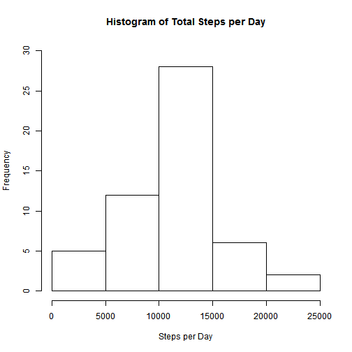
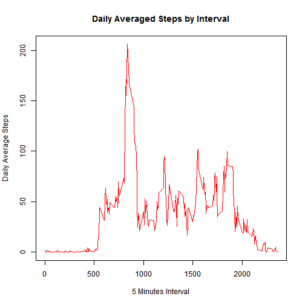
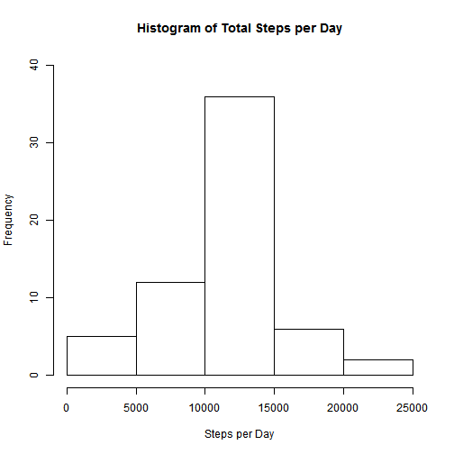
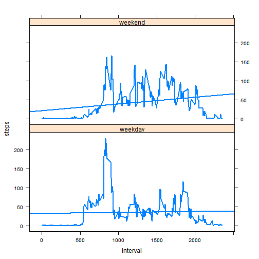

Reproducible Research: Peer Assessment 1
================================================

# Step 1: Loading and preprocessing the data

## 1. Load the data

```r
if (file.exists("activity.zip")) {
    unzip("activity.zip")
}
getwd()
```

```
## [1] "C:/Users/Chakri/Desktop/Coursera/Reproducible Research/RepData_PeerAssessment1"
```

```r
activity <- read.csv("activity.csv", header = TRUE, na.strings = "NA", stringsAsFactors = FALSE)
```

## 2. Process/transform the data into a format suitable for your analysis

```r
activity$date <- as.Date(activity$date, "%Y-%m-%d")
```


# Step 2: What is mean total number of steps taken per day?

## 1. Make a histogram of the total number of steps taken each day

Aggregate steps by date

```r
activity_aggr <- aggregate(steps ~ date, data = activity, FUN = sum, na.rm = TRUE)
# Generate histogram
hist(activity_aggr$steps, main = "Histogram of Total Steps per Day", xlab = "Steps per Day", 
    ylim = c(0, 30))
```

 


## 2. Calculate and report the mean and median total number of steps taken per day

```r
mean_steps <- mean(activity_aggr$steps)
median_steps <- median(activity_aggr$steps)
```

The mean of total steps taken per day is 1.0766 &times; 10<sup>4</sup>.
The median of total steps taken per day is 1.0765 &times; 10<sup>4</sup>.

# Step 3: What is the average daily activity pattern?

## 1. Make a time series plot (i.e. type = "l") of the 5-minute interval (x-axis) and the average number of steps taken, averaged across all days (y-axis)

Calculate average number of steps taken by 5-minute interval

```r
activity_steps_interval <- aggregate(steps ~ interval, data = activity, FUN = mean, 
    na.rm = TRUE)
# Plot time series plot
plot(activity_steps_interval$interval, activity_steps_interval$steps, type = "l", 
    main = "Daily Averaged Steps by Interval", xlab = "5 Minutes Interval", 
    ylab = "Daily Average Steps", col = "red")
```

 


## 2. Which 5-minute interval, on average across all the days in the dataset, contains the maximum number of steps?

```r
max_steps <- activity_steps_interval[activity_steps_interval$steps == max(activity_steps_interval$step), 
    "interval"]
```


The 5-minute interval which has the maximum number of step is 835

# Step 4: Imputing missing values

## 1. Calculate and report the total number of missing values in the dataset (i.e. the total number of rows with NAs)

```r
nrow(activity[is.na(activity$steps) == TRUE, ])
```

```
## [1] 2304
```

Total number of missing values in the data is 2304.

## 2. Devise a strategy for filling in all of the missing values in the dataset. The strategy does not need to be sophisticated. For example, you could use the mean/median for that day, or the mean for that 5-minute interval, etc.
Missing values have to be replaced with the mean for that 5-minute interval.

## 3. Create a new dataset that is equal to the original dataset but with the missing data filled in.

```r
filled <- activity

filled <- merge(filled, activity_steps_interval, by = "interval", sort = FALSE)

filled$approx_steps <- filled$steps.x

filled[is.na(filled$approx_steps), ]$approx_steps <- filled[is.na(filled$approx_steps), 
    ]$steps.y
```


## 4. Make a histogram of the total number of steps taken each day and Calculate and report the mean and median total number of steps taken per day. Do these values differ from the estimates from the first part of the assignment? What is the impact of imputing missing data on the estimates of the total daily number of steps?

```r

filled_aggr <- aggregate(approx_steps ~ date, data = filled, FUN = sum)

hist(filled_aggr$approx_steps, main = "Histogram of Total Steps per Day", xlab = "Steps per Day", 
    ylim = c(0, 40))
```

 

```r

filled_mean_steps <- mean(filled_aggr$approx_steps)

filled_median_steps <- median(filled_aggr$approx_steps)
```


The mean and median of total number steps taken per data are 1.0766 &times; 10<sup>4</sup> and 1.0766 &times; 10<sup>4</sup> respectively.

# Step 5: Are there differences in activity patterns between weekdays and weekends

## 1. Create a new factor variable in the dataset with two levels – “weekday” and “weekend” indicating whether a given date is a weekday or weekend day.

```r
library(chron)
```

```
## Warning: package 'chron' was built under R version 3.0.3
```

```r

filled$daytype <- factor(is.weekend(filled$date), labels = c("weekday", "weekend"))
```


## 2. Make a panel plot containing a time series plot (i.e. type = "l") of the 5-minute interval (x-axis) and the average number of steps taken, averaged across all weekday days or weekend days (y-axis). The plot should look something like the following, which was creating using simulated data:

```r
avgDayFilled <- aggregate(filled$approx_steps, list(filled$daytype, filled$interval), 
    mean)
names(avgDayFilled) <- c("daytype", "interval", "steps")
library(lattice)
```

```
## Warning: package 'lattice' was built under R version 3.0.3
```

```r
xyplot(steps ~ interval | daytype, data = avgDayFilled, layout = c(1, 2), type = c("l", 
    "r"), lwd = 2)
```

 


The graphs show that the weekend data seems more balanced and that it leans towards the right. The weekday data has its highest values to the left while the rest of the time series is not so elevated. This is further confirmed with a regression trendline that shows that weekend data has a positive slope while the weekday data is closer to a horizontal line.
